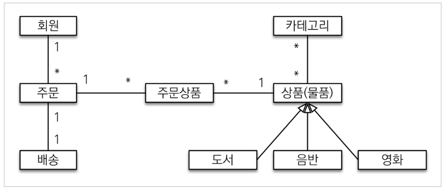
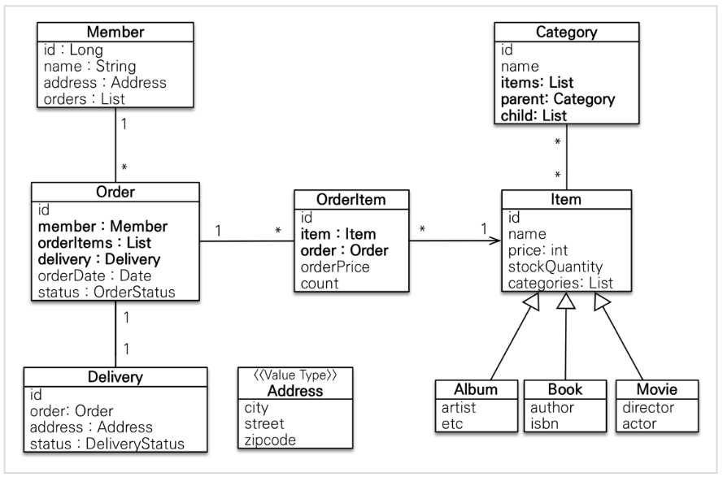
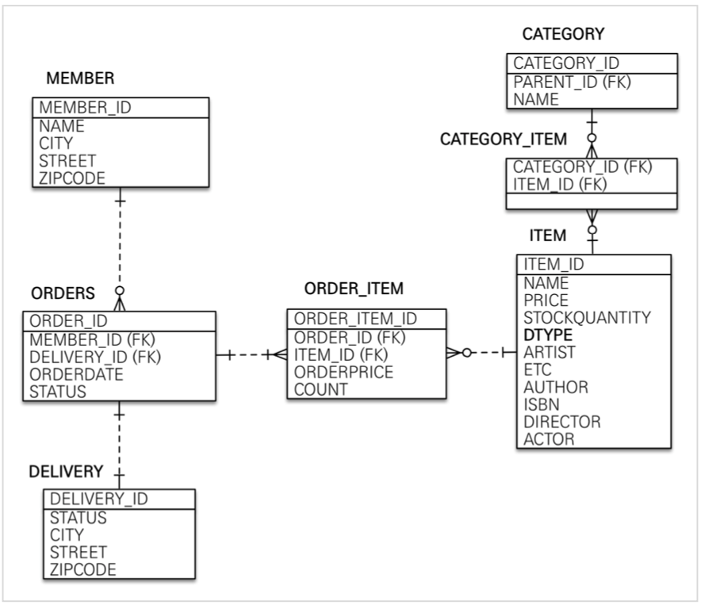

# Section 2. 도메인 분석 설계

------

## 요구사항 분석

- 기능 목록
  - 회원 기능
    - 회원 등록
    - 회원 조회
  - 상품 기능
    - 상품 등록
    - 상품 수정
    - 상품 조회
  - 주문 기능
    - 상품 주문
    - 주문 내역 조회
    - 주문 취소
  - 기타 요구사항
    - 상품은 재고 관리가 필요하다.
    - 상품의 종류는 도서, 음반, 영화가 있다.
    - 상품을 카테고리로 구분할 수 있다.


## 도메인 모델과 테이블 설계



- 회원, 주문, 상품의 관계
  - 회원은 여러 상품을 주문할 수 있다.
  - 그리고 한 번 주문할 때 여러 상품을 선택할 수 있으므로 주문과 상품은 N:N 관계다.
  - 하지만 이런 N:N 관계는 관계형 데이터베이스는 물론이고 엔티티에서도 거의 사용하지 않는다.
  - 따라서 그림처럼 ‘주문상품’ 이라는 엔티티를 추가해서 N:N 관계를 1:N, N:N 관계로 풀어냈다.
- 상품 분류: 상품은 도서, 음반, 영화로 구분되는데 상품이라는 공통 속성을 사용하므로 상속 구조로 표현했다.


### 회원 엔티티 분석



- 회원(Member): 이름과 임베디드 타입인 주소(Address), 그리고 주문(orders) 리스트를 가진다.
- 주문(Order): 한 번 주문시 여러 상품을 주문할 수 있으므로 주문과 주문상품(OrderItem)은 1:N 관계다. 주문은 상품을 주문한 회원과 배송 정보, 주문 날짜, 주문 상태(status)를 가지고 있다. 주문 상태는 열거형을 사용했는데, 주문(ORDER), 취소(CANCEL)을 표현할 수 있다. (회원을 통해 주문을 생성하는 관점이 아닌, 주문을 생성할 때 회원이 필요하다는 관점으로 보는 것이 시스템 적으로 맞다)
- 주문상품(OrderItem): 주문한 상품 정보와 주문 금액(orderPrice), 주문 수량(count) 정보를 가지고 있다. (보통 OrderLine, LineItem 으로 많이 표현한다.)
- 상품(Item): 이름, 가격, 재고수량(stockQuantity)을 가지고 있다. 상품을 주문하면 재고수량이 줄어든다. 상품의 종류로는 도서, 음반, 영화가 있는데 각각은 사용하는 속성이 조금씩 다르다.
- 배송(Delivery): 주문시 하나의 배송 정보를 생성한다. 주문과 배송은 일대일 관계다.
- 카테고리(Category): 상품과 n:n 관계를 맺는다. `parent`, `child` 로 부모, 자식 카테고리를 연결한다.
- 주소(Address): 값 타입(임베디드 타입)이다. 회원과 배송(Delivery)에서 사용한다.

> 참고: 회원이 주문을 하기 때문에, 회원이 주문리스트를 가지는 것은 얼핏 보면 잘 설계한 것 같지만, 객체 세상은 실제 세계와는 다르다. 실무에서는 회원이 주문을 참조하지 않고, 주문이 회원을 참조하는 것으로 충분하다. 여기서는 1:N, N:N의 양방향 연관관계를 설명하기 위해서 추가했다.

- ```
  @Embedded
  ```

  : 새로운 값 타입을 직접 정의해서 사용할 수 있는데, JPA에서는 이것을 임베디드 타입이라 한다. 이러한 임베디드 타입도 int, String 처럼 값 타입이라는 것이다.

  - 사용법
    - `@Embeddable`: 값 타입을 정의하는 곳에 표시
    - `@Embedded` : 값 타입을 사용하는 곳에 표시
    - 임베디드 타입은 기본 생성자가 필수
  - reference: https://velog.io/@conatuseus/JPA-임베디드-타입embedded-type-8ak3ygq8wo


### 회원 테이블 분석



- MEMBER: 회원 엔티티의 Address 임베디드 타입 정보가 회원 테이블에 그대로 들어갔다. 이것은 DELIVERY 테이블도 마찬가지다.
- ITEM: 앨범, 도서, 영화 타입을 통합해서 하나의 테이블로 만들었다. DTYPE 컬럼으로 타입을 구분한다. (싱글 테이블 전략 - 한 테이블에 다 때려박는거)

> 참고: 테이블명이 `ORDER` 가 아니라 `ORDERS` 인 것은 데이터베이스가 `ORDER BY` 때문에 예약어로 잡고 있는 경우가 많다. 그래서 관례상 `ORDERS` 를 많이 사용한다.

> 참고: 실제 코드에서는 DB에 소문자 + *(언더스코어) 스타일을 사용하겠다. 데이터베이스 테이블명, 컬럼명에 대한 관례는 회사마다 다르다. 보통은 대문자 +*(언더스코어)나 소문자 + *(언더스코어) 방식 중에 하나를 지정해서 일관성 있게 사용한다. 강의에서 설명할 때는 객체와 차이를 나타내기 위해 데이터베이스 테이블, 컬럼명은 대문자를 사용했지만, 실제 코드에서는 소문자 +*(언더스코어) 스타일을 사용하겠다.


### 연간관계 매핑 분석

- 회원과 주문: 일대다, 다대일의 양방향 관계다. 따라서 연관관계의 주인을 정해야 하는데, 외래 키가 있는 주문을 연관관계의 주인으로 정하는 것이 좋다. 그러므로 `Order.member` 를 `ORDERS.MEMBER_ID` 외래 키와 매핑한다
- 주문상품과 주문: 다대일 양방향 관계다. 외래 키가 주문상품에 있으므로 주문상품이 연관관계의 주인이다. 그러므로 `OrderItem.order` 를 `ORDER_ITEM.ORDER_ID` 외래 키와 매핑한다.
- 주문상품과 상품: 다대일 단방향 관계다. `OrderItem.item` 을 `ORDER_ITEM.ITEM_ID` 외래 키와 매핑한다.
- 주문과 배송: 일대일 양방향 관계다. `[Order.delivery](<http://Order.delivery>)` 를 `ORDERS.DELIVERY_ID` 외래 키와 매핑한다.
- 카테고리와 상품: `@ManyToMany` 를 사용해서 매핑한다. (실무에서 @ManyToMany 는 사용하지 말자. 여기서는 다대다 관계를 예제대로 보여주기 위해 추가했을 뿐이다)

> 참고: 외래 키가 있는 곳을 연관관계의 주인으로 정해라. (내가 이해한 바로는 1:N 관계에서 N 쪽이 연관관계의 주인인듯하다) 연관관계의 주인은 단순히 외래 키를 누가 관리하냐의 문제이지 비즈니스상 우위에 있다고 주인으로 정하면 안된다. 예를 들어서 자동차와 바퀴가 있으면, 일대다 관계에서 항상 다쪽에 외래 키가 있으므로 외래 키가 있는 바퀴를 연관관계의 주인으로 정하면 된다. 물론 자동차를 연관관계의 주인으로 정하는 것이 불가능 한 것은 아니지만, 자동차를 연관관계의 주인으로 정하면 자동차가 관리하지 않는 바퀴 테이블의 외래 키 값이 업데이트 되므로 관리와 유지보수가 어렵고, 추가적으로 별도의 업데이트 쿼리가 발생하는 성능 문제도 있다.


## 엔티티 클래스 개발

- 예제에서는 설명을 쉽게하기 위해 엔티티 클래스에 Getter, Setter를 모두 열고, 최대한 단순하게 설계
- <u>실무에서는 가급적 Getter는 열어두고, Setter는 꼭 필요한 경우에만 사용하는 것을 추천</u>

> 참고: 이론적으로 Getter, Setter 모두 제공하지 않고, 꼭 필요한 별도의 메서드를 제공하는게 가장 이상적이다. 하지만 실무에서 엔티티의 데이터는 조회할 일이 너무 많으므로, Getter의 경우 모두 열어두는 것이 편리하다. Getter는 아무리 호출해도 호출 하는 것 만으로 어떤 일이 발생하지는 않는다. 하지만 Setter는 문제가 다르다. Setter를 호출하면 데이터가 변한다. Setter를 막 열어두면 가까운 미래에 엔티티가 도대체 왜 변경되는지 추적하기 점점 힘들어진다. 그래서 엔티티를 변경할 때는 Setter 대신에 변경 지점이 명확하도록 변경을 위한 비즈니스 메서드를 별도로 제공해야 한다.

```java
/* 멤버 엔티티 */
package jpabook.jpashop.model;

import lombok.Getter;
import lombok.Setter;

import javax.persistence.*;
import java.util.ArrayList;
import java.util.List;

@Entity
@Getter
@Setter
public class Member {

    @Id
    @GeneratedValue
    private Long id;

    private String username;

    @Embedded
    private Address address;

    @OneToMany(mappedBy = "member")
    private List<Order> orders = new ArrayList<>();
}
```

- `@OneToMany(mappedBy = "member")` : 연관관계의 주인을 정할 때 사용
  - 주인은 mappedBy 속성을 사용하지 않는다.
  - 주인이 아니면 mappedBy 속성을 사용해서 속성의 값으로 연관관계의 주인을 정할 수 있다.
  - 즉, Member 는 연관관계의 주인이 아니기 때문에 orders 필드에 mappedBy 속성을 사용하여 주인이 아님을 JPA에게 알려준다.
  - 멤버 입장에서 많은 order (1:N) 을 가지고 있기 때문에 `@OneToMany` 어노테이션을 달아주고, orders 필드는 member에 의해 매핑됨을 의미한다.
  - 연관관계의 주인은 보통 FK 를 들고 있는 객체가 연관관계의 주인이 된다.

> 참고: 엔티티의 식별자는 `id` 를 사용하고 PK 컬럼명은 `member_id` 를 사용했다. 엔티티는 타입(여기서는 `Member`)이 있으므로 `id` 필드만으로 쉽게 구분할 수 있다. 테이블은 타입이 없으므로 구분이 어렵다. 그리고 테이블은 관례상 테이블명+id 를 많이 사용한다. 참고로 객체에서 id 대신에 `memberId` 를 사용해도 된다. 중요한 것은 일관성이다.

```java
/* Item 추상 클래스 */
package jpabook.jpashop.domain.item;

import lombok.Getter;
import lombok.Setter;

import javax.persistence.*;

@Entity
@Inheritance(strategy = InheritanceType.SINGLE_TABLE)
@Getter
@Setter
public abstract class Item {
    /**
     * 구현체가 (하위에 있는) Album, Book, Movie 등이 있기 때문에
     * 추상클래스로 구현함
     */
    @Id
    @GeneratedValue
    @Column(name = "item_id")
    private Long id;

    private String name;
    private int price;
    private int stockQuantity;

}
```

- `@Inheritance(strategy = {InheritanceType})` : 객체의 입장에서 상속관계는 포현이 가능하지만 RDB 입장에서는 기본적으로 상속관계를 표현할 수 있는 방법이 없다. 따라서 JPA 에서는 다음과 같은 3가지 전략을 사용해 상속 관계를 저장할 수 있도록 한다.
  - InheritanceType.SINGLE_TABLE: 한 테이블에 다 때려 박는 것 (통합 테이블로 변환하는 단일 테이블 전략)
  - InheritanceType.JOINED: 가장 정교화된 스타일 (각각의 테이블로 변환하는 조인 전략)
  - InheritanceType.TABLE_PER_CLASS: Book, Movie, Album 처럼 3개의 테이블로 나오는 전략
- `@DiscriminatorValue("A")` : Inheritance 전략이 JOINED 일 때 사용하는 어노테이션으로, 엔티티 저장시 구분 컬럼에 입력할 값을 지정한다. "A" 라 지정한다면 엔티티를 저장할 때 부모 클래스인 Item 의 DTYPE 에 A가 저장된다.

- `JoinColumn(name = "member_id")` : 외래키를 매핑 할 때 사용한다.
  - name 속성에는 매핑할 외래키 이름을 지정한다.
  - Order 엔티티의 경우 Delivery 엔티티의 id 값을 매핑한다.

``` java
@Entity
@Getter
@Setter
public class Delivery {
  @Id
  @GeneratedValue
  @Column(name = "deliver_id")
  Long id;
  
  @OneToOne(mappedBy = "delivery")
  private Order order;
  
  @Embedded
  private Address address;
  
  @Enumerated(EnumType.STRING)
  private DeliveryStatus status;
}
```

- `@Enumerated(EnumType.STRING)`: EnumType.ORDINAL 이 기본값인데 이는 enum 에 대한 값들이 숫자(integer) 로 DB에 들어가게 된다. 이 때, 숫자로 들어가게 된다면, 중간에 새로운 타입이 생겼을 경우에 꼬이게 되므로 무조건 EumType은 EnumType.STRING 으로 사용할 것!


```java
/* OrderItem 엔티티 */
package jpabook.jpashop.model;

import lombok.Getter;
import lombok.Setter;

import javax.persistence.*;

@Entity
@Getter
@Setter
public class OrderItem {

    @Id
    @GeneratedValue
    @Column(name = "order_item_id")
    private Long id;

    private Item item;

    @ManyToOne
    @JoinColumn(name = "order_id")
    // 하나의 Order 가 여러개의 OrderItem을 가질 수 있다.
    // OrderItem은 하나의 Order만 가질 수 잇다.
    private Order order;

    private int orderPrice; // 주문가격
    private int count; // 주문수량

}
```


``` java
@Entity
@Table(name = "orders")
@Getter
public class Order {
  @Id
  @GeneratedValue
  @Column(name = "order_id")
  private Long id;
  
  @ManyToOne
  @JoinColumn(name = "member_id") // 매핑을 무엇으로 할 것인지 == FK
  private Member member; // order 랑 member 는 다대일 관계
  
  @OneToMany(mappedBy = "order")
  private List<OrderItem> orderItems = new ArrayList<>();
  
  @OneToOne // Delivery랑은 일대일 관계다.
  private Delivery delivery;
  
  private LocalDateTime orderDate; // hibernate가 알아서 지원해줌
  
  @Enumberated(EnumType.STRING)
  private OrderStatus status; // 주문 상태 [ORDER, CANCEL]
}
```

- 하나의 주문정보는 하나의 배송정보를 가져야 하며, 하나의 배송정보는 하나의 주문 정보를 가져야 한다.
- 이 때, `@OneToOne` 으로 이러한 관계 설정이 가능하다.
- 이 때, 일대일 관계는 FK를 Order에 둬도 되고, Deliver에 둬도 되는데 보통은 access 가 많이 이루어지는 곳인 Order 에 둔다.
  - Order를 통해 Delivery를 찾는 경우는 많지만, Delivery 를 통해 order를 찾는 일은 흔하지 않다.
  - 따라서 연관관계의 주인은 Order에 있는 delivery에다가 준다.


## 엔티티 설계시 주의점