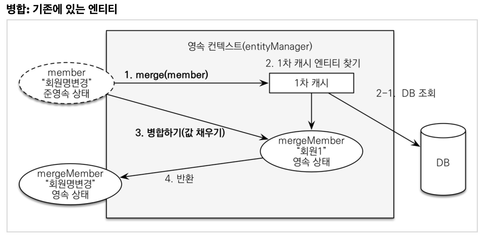

# 섹션 7. 웹 계층 개발

### 목차

- 홈 화면과 레이아웃
- 회원등록
- 회원 목록 조회
- 상품 등록
- 상품 목록
- 상품 수정
- 변경 감지와 병합(merge)
- 상품 주문
- 주문 목록 검색, 취소


## 홈 화면과 레이아웃

### 홈 컨트롤러 등록

``` java
package jpabook.jpashop.web;

import lombok.extern.slf4j.Slf4j;
import org.springframework.stereotype.Controller;
import org.springframework.web.bind.annotation.RequestMapping;

@Controller
@Slf4j
public class HomeController {
  @RequestMapping("/")
  public String home() {
    log.info("home controller");
    return "home";
  }
}
```


### 스프링부트 타임리프 기본 설정

``` yaml
spring:
  thymeleaf:
    prefix: classpath:/templates/
    suffix: .html
```

- 스프링부트 타임리프 viewName 매핑
  - `resources:templates/` + {viewName} + `.html`
  - `resources:templates/hmoe.html`

반환된 문자(`home`)와 스프링부트 설정(prefix, suffix) 정보를 사용해서 렌더링할 뷰(html)를 찾는다.


### 타임리프 템플릿 등록

``` html
<!-- home.html -->
<!DOCTYPE HTML>
<html xmlns:th="http://www.thymeleaf.org">
<head th:replace="fragments/header :: header">
    <title>Hello</title>
    <meta http-equiv="Content-Type" content="text/html; charset=UTF-8"/>
</head>
<body>
<div class="container">
    <div th:replace="fragments/bodyHeader :: bodyHeader"/>
    <div class="jumbotron"><h1>HELLO SHOP</h1>
        <p class="lead">회원 기능</p>
        <p>
            <a class="btn btn-lg btn-secondary" href="/members/new">회원 가입</a>
            <a class="btn btn-lg btn-secondary" href="/members">회원 목록</a></p>
        <p class="lead">상품 기능</p>
        <p>
            <a class="btn btn-lg btn-dark" href="/items/new">상품 등록</a>
            <a class="btn btn-lg btn-dark" href="/items">상품 목록</a></p>
        <p class="lead">주문 기능</p>
        <p>
            <a class="btn btn-lg btn-info" href="/order">상품 주문</a>
            <a class="btn btn-lg btn-info" href="/orders">주문 내역</a></p>
    </div>
    <div th:replace="fragments/footer :: footer"/>
</div> <!-- /container -->
</body>
</html>
 
```


### fragments/header

``` html
<!DOCTYPE html>
<html xmlns:th="http://www.thymeleaf.org">
<head th:fragment="header">
    <!-- Required meta tags -->
    <meta charset="utf-8">
    <meta name="viewport" content="width=device-width, initial-scale=1, shrink-
  to-fit=no">
    <!-- Bootstrap CSS -->
    <link rel="stylesheet" href="/css/bootstrap.min.css" integrity="sha384-
  ggOyR0iXCbMQv3Xipma34MD+dH/1fQ784/j6cY/iJTQUOhcWr7x9JvoRxT2MZw1T"
          crossorigin="anonymous">
    <!-- Custom styles for this template -->
    <link href="/css/jumbotron-narrow.css" rel="stylesheet">
    <title>Hello, world!</title>
</head>
```


### fragments/bodyHeader

``` html
<!DOCTYPE html>
<html xmlns:th="http://www.thymeleaf.org">
<div class="header" th:fragment="bodyHeader">
    <ul class="nav nav-pills pull-right">
        <li><a href="/">Home</a></li>
    </ul>
    <a href="/"><h3 class="text-muted">HELLO SHOP</h3></a>
</div>
```


### fragments/footer.html

``` html
<!DOCTYPE html>
<html xmlns:th="http://www.thymeleaf.org">
<div class="footer" th:fragment="footer">
    <p>&copy; Hello Shop V2</p>
</div>
```


> 참고: Hierachical-style layouts
>
> 예제에서는 뷰 템플릿을 최대한 간단하게 설명하려고 `header`, `footer` 같은 템플릿 파일을 반복해서 포함한다. 다음 링크의 Hierarchical-style layouts을 참고하면 이런 부분도 중복을 제거할 수 있다.
>
> https://www.thymeleaf.org/doc/articles/layouts.html


> 참고: 뷰 템플릿 변경사항을 서버 재시작 없이 즉시 반영하기
>
> 1. spring-boot-devtools 추가
> 2. html 파일 build -> Recompile


### view 리소스 등록

이쁜 디자니을 위해 부트스트랩을 사용. (https://getbootstrap.com/) => 버전 4.x 사용

- `resources/static` 하위에 `css`, `js` 추가
- `resources/static/css/jumbotron-narrow.css` 추가

- jumbotron-narrow.css 파일

  ``` css
  /* Space out content a bit */
  body {
      padding-top: 20px;
      padding-bottom: 20px;
  }
  
  /* Everything but the jumbotron gets side spacing for mobile first views */
  .header,
  .marketing,
  .footer {
      padding-left: 15px;
      padding-right: 15px;
  }
  
  /* Custom page header */
  .header {
      border-bottom: 1px solid #e5e5e5;
  }
  
  /* Make the masthead heading the same height as the navigation */
  .header h3 {
      margin-top: 0;
      margin-bottom: 0;
      line-height: 40px;
      padding-bottom: 19px;
  }
  
  /* Custom page footer */
  .footer {
      padding-top: 19px;
      color: #777;
      border-top: 1px solid #e5e5e5;
  }
  
  /* Customize container */
  @media (min-width: 768px) {
      .container {
          max-width: 730px;
      }
  }
  
  .container-narrow>hr {
      margin: 30px 0;
  }
  
  /* Main marketing message and sign up button */
  .jumbotron {
      text-align: center;
      border-bottom: 1px solid #e5e5e5;
  }
  
  .jumbotron .btn {
      font-size: 21px;
      padding: 14px 24px;
  }
  
  /* Supporting marketing content */
  .marketing {
      margin: 40px 0;
  }
  
  .marketing p+h4 {
      margin-top: 28px;
  }
  
  /* Responsive: Portrait tablets and up */
  @media screen and (min-width: 768px) {
  
      /* Remove the padding we set earlier */
      .header,
      .marketing,
      .footer {
          padding-left: 0;
          padding-right: 0;
      }
  
      /* Space out the masthead */
      .header {
          margin-bottom: 30px;
      }
  
      /* Remove the bottom border on the jumbotron for visual effect */
      .jumbotron {
          border-bottom: 0;
      }
  }
  ```


### 회원 등록

- 폼 객체를 사용해서 화면 계층과 서비스 계층을 명확하게 분리한다.

``` java
package jpabook.jpashop.web;

import lombok.Getter;
import lombok.Setter;

@Getter
@Setter
public class MemberForm {

    @NotEmpty(message = "회원 이름은 필수 입니다")
    private String name;

    private String city;
    private String street;
    private String zipcode;
}
```

- `@NotEmpty` 는  `javax.validation.constraints` 를 import 해야만 사용할 수 있는데 스프링부트 2.3.0 버전부터는 web-starter 모듈에 validation 패키지가 제외되어서 별도로 dependency 지정이 필요하다.

- gradle 사용하는 경우

  ``` gradle
  implementation 'org.springframework.boot:spring-boot-starter-validation'
  ```

- maven 사용하는 경우

  ``` xml
  <dependency>
  	<groupId>org.springframework.boot</groupId>
  	<artifactId>spring-boot-starter-validation</artifactId>
  </dependency>
  ```


### 회원 등록 컨트롤러

``` java
package jpabook.jpashop.controller;

import javax.validation.Valid;
import jpabook.jpashop.domain.Address;
import jpabook.jpashop.domain.Member;
import jpabook.jpashop.service.MemberService;
import jpabook.jpashop.web.MemberForm;
import lombok.RequiredArgsConstructor;
import org.springframework.stereotype.Controller;
import org.springframework.ui.Model;
import org.springframework.validation.BindingResult;
import org.springframework.web.bind.annotation.GetMapping;
import org.springframework.web.bind.annotation.PostMapping;

@Controller
@RequiredArgsConstructor
public class MemberController {

    private final MemberService memberService;

    @GetMapping(value = "/members/new")
    public String createForm(Model model) {
        model.addAttribute("memberForm", new MemberForm());
        return "members/createMemberForm";
    }

    @PostMapping(value = "/members/new")
    public String create(@Valid MemberForm form, BindingResult result) {

        if (result.hasErrors()) {
            return "members/createMemberForm";
        }

        Address address = new Address(form.getCity(), form.getStreet(), form.getZipcode());
        Member member = new Member();
        member.setName(form.getName());
        member.setAddress(address);

        memberService.join(member);

        return "redirect:/";
    }
}

```

- `@Valid` : MemberForm 객체 내부에 있는 javax.validation 관련 어노테이션을 자동으로 인식해서 validation 처리를 해준다.
- `BindingResult`:


## 회원 목록 조회

### 회원 목록 컨트롤러 추가

``` java
package jpabook.jpashop.web;

@Controller
@RequiredArgsConstructor
public class MemberController {
  // 추가
  @GetMapping(value = "/members")
  public String list(Model model) {
    List<Member> members = memberService.findMembers();
    model.addAttribute("members", members);
    return "members/memberList";
  }
}
```

- 조회한 상품을 뷰에 전달하기 위해 스프링 MVC가 제공하는 모델(Model) 객체에 보관
- 실행할 뷰 이름을 반환


### 회원 목록 뷰(`templates/members/memberList.html`)

``` html
<!DOCTYPE HTML>
  <html xmlns:th="http://www.thymeleaf.org">
  <head th:replace="fragments/header :: header" />
  <body>
  <div class="container">
      <div th:replace="fragments/bodyHeader :: bodyHeader" />
      <div>
          <table class="table table-striped">
              <thead>
              <tr>
                  <th>#</th>
<th>이름</th> <th>도시</th> <th>주소</th> <th>우편번호</th>
              </tr>
              </thead>
              <tbody>
              <tr th:each="member : ${members}">
                  <td th:text="${member.id}"></td>
                  <td th:text="${member.name}"></td>
                  <td th:text="${member.address?.city}"></td>
                  <td th:text="${member.address?.street}"></td>
                  <td th:text="${member.address?.zipcode}"></td>
              </tr>
              </tbody>
        </table>
    </div>
    	<div th:replace="fragments/footer :: footer" />
    
    </div> <!-- /container -->
</body>
</html>
```

> 참고: 타임리프에서 ?를 사용하면 null 을 무시한다.

> 참고: 폼 객체 vs 엔티티 직접 사용
>
> 참고: 요구사항이 정말 단순할 때는 폼 객체(MemberForm) 없이 엔티티(Member)를 직접 등록과 수정화면에서 사용해도 된다. 하지만 화면 요구사항이 복잡해지기 시작하면, 엔티티에 화면을 처리하기 위한 기능이 점점 증가한다. 결과적으로 엔티티는 점점 화면에 종속적으로 변하고, 이렇게 화면 기능 때문에 지저분해진 엔티티는 결국 유지보수하기 어려워진다. 실무에서 엔티티는 핵심 비즈니스 로직만 가지고 있고, 화면을 위한 로직은 없어야 한다. 화면이나 API에 맞는 폼 객체나 DTO를 사용하자. 그래서 화면이나 API 요구사항을 이것들로 처리하고, 엔티티는 최대한 순수하게 유지하자.


## 상품 등록

### 상품 등록 폼

``` java
package jpabook.jpashop.web;

import lombok.Getter;
import lombok.Setter;

@Getter
@Setter
public class BookForm {
  private Long id;
  private String name;
  private int price;
  private int stockQuantity;
  private String author;
  private String isbn;
}
```


### 상품 등록 컨트롤러

``` java
package jpabook.jpashop.web;

import jpabook.jpashop.domain.item.Book;
import jpabook.jpashop.domain.item.Item;
import jpabook.jpashop.service.ItemService;
import lombok.RequiredArgsConstructor;
import org.springframework.stereotype.Controller;
import org.springframework.ui.Model;
import org.springframework.web.bind.annotation.*;

import java.util.List;

@Controller
@RequiredArgsConstructor
public class ItemController {
  private final ItemService itemService;
  
  @GetMapping(value = "/items/new")
  public String createForm(Model model) {
    model.addAttribute("form", new BookForm());
    return "items/createItemForm";
  }
  
  @PostMapping(value = "/items/new")
  public String create(BookForm form) {
    Book book = new Book();
    book.setName(form.getName());
    book.setPrice(form.getPrice());
    book.setStockQuantity(form.getStockQuantity());
    book.setAuthor(form.getAuthor());
    book.setIsbn(form.getIsbn());
    
    itemService.saveItem(book);
    return "redirect:/items";
  }
}
```


### 상품 등록 뷰(`items/createItemForm.html`)

``` html
<!DOCTYPE HTML>
<html xmlns:th="http://www.thymeleaf.org">
  <head th:replace="fragments/header :: header" />
  <body>
    <div class="container">
      <div th:replace="fragments/bodyHeader :: bodyHeader" />
      
      <form th:action="@{/items/new}" th:object="${form}" method="post">
        <div class="form-group">
          <label th:for="name">상품명</label>
          <input type="text" th:field="*{name}" class="form-control" placeholder="이름을 입력하세요">
        </div>
        
        <div class="form-group">
          <label th:for="price">가격</label>
          <input type="number" th:field="*{price}" class="form-control" placeholder="가격을 입력하세요">
        </div>
        
        <div class="form-group">
          <label th:for="stockQuantity">수량</label>
          <input type="number" th:field="*{stockQuantity}" class="form-control" placeholder="수량을 입력하세요">
        </div>
        
        <div class="form-group">
          <label th:for="author">저자</label>
          <input type="text" th:field="*{author}" class="form-control" placeholder="저자를 입력하세요">
        </div>
        
        <div class="form-group">
          <label th:for="isbn">ISBN</label>
          <input type="text" th:field="*{isbn}" class="form-control" placeholder="ISBN을 입력하세요">
        </div>
        <button type="submit" class="btn btn-primary">Submit</button>
      </form>
      <br />
      <div th:replace="fragments/footer :: footer" />
      
    </div> <!-- /container -->
  </body>
</html>
```

- 상품 등록 폼에서 데이터를 입력하고 submit 버튼을 클릭하면 `/items/new` 를 POST 방식으로 요청
- 상품 저장이 끝나면 상품 목록 화면(`redirect:/items`) 으로 리다이렉트


## 상품 목록

### 상품 목록 컨트롤러

``` java
package jpabook.jpashop.web;

@Controller
@RequiredArgsConstructor
public class ItemController {
  private final ItemService itemService;
  
  /**
   * 상품 목록
   */
  @GetMapping(value = "/items")
  public String list(Model model) {
    List<Item> items = itemService.findItems();
    model.addAttribute("items", items);
    return "items/itemList";
  }
}
```


### 상품 목록 뷰(`items/itemList.html`)

``` xml
<!DOCTYPE HTML>
<html xmlns:th="http://www.thymeleaf.org">
  <head th:replace="fragments/header :: header" />
  <body>
    
    <div class="container">
      <div th:replace="fragments/bodyHeader :: bodyHeader"/>
      
      <div>
        <table class="table table-striped">
          <thead>
            <tr>
              <th>#</th>
              <th>상품명</th>
              <th>가격</th>
              <th>재고수량</th>
              <th></th>
            </tr>
          </thead>
          <tbody>
            <tr th:each="item : ${items}">
              <td th:text="${item.id}"></td>
              <td th:text="${item.name}"></td>
              <td th:text="${item.price}"></td>
              <td th:text="${item.stockQuantity}"></td>
              <td>
                <a href="#" th:href="@{/items/{id}/edit (id=${item.id})}" class="btn btn-primary" role="button">수정</a>
              </td>
            </tr>
          </tbody>
        </table>
      </div>
      
      <div th:replace="fragments/footer :: footer"/>
      
    </div> <!-- /container -->
  </body>
</html>
```

- `model` 에 담아둔 상품 목록인 `items` 를 꺼내서 상품 정보를 출력


## 상품 수정

### 상품 수정과 관련된 컨트롤러 코드

``` java
package japbook.jpashop.web;

import jpabook.jpashop.domain.item.Book;
import jpabook.jpashop.domain.item.Item;
import jpabook.jpashop.service.ItemService;
import lombok.RequiredArgsConstructor;
import org.springframework.stereotype.Controller;
import org.springframework.ui.Model;
import org.springframework.web.bind.annoation.*;

import java.util.List;

@Controller
@RequiredArgsConstructor
public class ItemController {
  /**
   * 상품 수정 폼
   */
  @GetMapping(value = "/items/{itemId}/edit")
  public String updateItemForm(@PathVariable("itemId") Long itemId, Model model) {
    
    Book item = (Book) itemService.findOne(itemId);
    
    BookForm form = new BookForm();
    form.setId(item.getId());
    form.setName(item.getName());
    form.setPrice(item.getPrice());
    form.setStockQuantity(item.getStockQuantity());
    form.setAuthor(item.getAuthor());
    form.setIsbn(item.getIsbn());
    
    model.addAttribute("form", form);
    return "items/updateItemForm";
  }
  
  /**
   * 상품 수정
   */
  @PostMapping(value = "/items/{itemId}/edit")
  public String updateItem(@ModelAttribute("form") BookForm form) {

    Book book = new Book();
    book.setId(form.getId());
    book.setName(form.getName());
    book.setPrice(form.getPrice());
    book.setStockQuantity(form.getStockQuantity());
    book.setAuthor(form.getAuthor());
    book.setIsbn(form.getIsbn());
    
    itemService.saveItem(book);
    return "redirect:/items";
  }
}
```


### 상품 수정 폼 화면(`items/updateItemForm`)

``` html
<!DOCTYPE HTML>
<html xmlns:th="http://www.thymeleaf.org">
  <head th:replace="fragments/header :: header" />
  <body>
    <div class="container">
      <div th:replace="fragments/bodyHeader :: bodyHeader"/>
      
      <form th:object="${form}" method="post">
        <!-- id -->
        <input type="hidden" th:field="*{id}" />
        
        <div class="form-group">
          <label th:for="name">상품명</label>
          <input type="text" th:field="*{name}" class="form-control" placeholder="이름을 입력하세요" />
        </div>
        
        <div class="form-group">
          <label th:for="price">가격</label>
          <input type="number" th:field="*{price}" class="form-control" placeholder="가격을 입력하세요" />
        </div>
        
        <div class="form-group">
          <label th:for="stockQuantity">수량</label>
          <input type="number" th:field="*{stockQuantity}" class="form-control" placeholder="수량을 입력하세요" />
        </div>
        
        <div class="form-group">
          <label th:for="author">저자</label>
          <input type="text" th:field="*{author}" class="form-control" palceholder="저자를 입력하세요" />
        </div>
        
        <div class="form-group">
          <label th:for="isbn">ISBN</label>
          <input type="text" th:field="*{isbn}" clas="form-control" placeholder="ISBN을 입력하세요" />
        </div>
        <button type="submit" class="btn btn-primary">Submit</button>
      </form>
      
      <div th:replace="fragments/footer :: footer" />
      
    </div> <!-- /container -->
  </body>
</html>
```

- 상품 수정 폼 이동
  1. 수정 버튼을 선택하면 `/items/{itemId}/edit` URL을 GET 방식으로 요청
  2. 그 결과로 `updateItemForm()` 메서드를 실행하는데 이 메서드는 `itemService.findOne(itemId)` 를 호출해서 수정할 상품을 조회
  3. 조회 결과를 모델 객체에 담아서 뷰(`items/updateItemForm`) 에 전달
- 상품 수정 실행: 상품 수정 폼 HTMl에는 상품의 id(hidden), 상품명, 가격, 수량 정보 있음
  1. 상품 수정 폼에서 정보를 수정하고 Submit 버튼을 선택
  2. `/items/{itemId}/edit` URL을 POST 방식으로 요청하고 `updateItem()` 메서드를 실행
  3. 이때 컨트롤러에 파라미터로 넘어온 `item` 엔티티 인스턴스는 현재 준영ㄴ속 상태다. 따라서 영속성 컨텍스트의 지원을 받을 수 없고 데이터를 수정해도 변경 감지 기능은 동작X


## 변경 감지와 병합(merge) => 굉장히 중요

### 준영속 엔티티

영속성 컨테스트가 더는 관리하지 않는 엔티티를 말한다. (여기서는 `itemService.saveItem(book)` 에서 수정을 시도하는 Book 객체다. Book 객체는 이미 DB에 한번 저장되어서 식별자가 존재한다. 이렇게 임의로 만들어낸 엔티티도 기존 식별자를 가지고 있으면 준영속 엔티티로 볼 수 있다.)


### 준영속 엔티티를 수정하는 2가지 방법

- 변경 감지 기능 사용

  ``` java
  @Transactional
  void update(Item itemParam) { // itemParam: 파라미터로 넘어온 준영속 상태의 엔티티
    Item findItem = em.find(Item.class, itemParam.getId()); // 같은 엔티티를 조회한다.
    findItem.setPrice(itemParam.getPrice()); // 데이터를 수정한다.
  }
  ```

  - 영속성 컨텍스트에서 엔티티를 다시 조회한 후에 데이터를 수정하는 방법
  - 트랜잭션 안에서 엔티티를 다시 조회, 변경할 값 선택 => 트랜잭션 커밋 시점에 변경 감지(Dirty Checking)가 동작해서 데이터베이스에 UPDATE SQL 실행

- 병합(`merge`) 사용 => `ItemRepository.save` 의 else 문

  ``` java
  @Transactional
  void update(Item itemParam) { // itemParam: 파라미터로 넘어온 준영속 상태의 엔티티
    Item mergeItem = em.merge(item);
  }
  ```

  

  1. `merge()` 를 실행한다.
  2. 파라미터로 넘어온 준영속 엔티티의 식별자 값으로 1차 캐시에서 엔티티를 조회한다. 만약 1차 캐시에 엔티티가 없으면 데이터베이스에서 엔티티를 조회하여 1차 캐시에 저장한다.
  3. 조회한 영속 엔티티(`mergeMember`)에 `member` 엔티티의 값을 채워 넣는다. (member 엔티티의 모든 값을 mergeMember에 밀어 넣는다. 이때 mergeMember의 "회원1" 이라는 이름이 "회원명변경"으로 바뀐다.)
  4. 영속 상태인 mergeMember를 반환한다.

- 병합시 동작 방식 정리

  1. 준영속 엔티티의 식별자 값으로 영속 엔티티를 조회한다.
  2. 영속 엔티티의 값을 준영속 엔티티의 값으로 모두 교체한다. (병합한다.)
  3. 트랜잭션 커밋 시점에 변경 감지 기능이 동작해서 데이터베이스에 UPDATE SQL이 실행

> 주의: 변경 감지 기능을 사용하면 원하는 속성만 선택해서 변경할 수 있지만, 병합을 사용하면 모든 속성이 변경된다. 병합시 값이 없으면 null 로 업데이트 할 위험도 있다. (병합은 모든 필드를 교체한다.)


### 상품 리포지토리의 저장 메서드 분석

``` java
package jpabook.jpashop.repository;

@Repository
public class ItemRepository {
  @PersistenceContext
  EntityManager em;
  
  public void save(Item item) {
    if (item.getId() == null) {
      em.persist(item);
    } else {
      em.merge(item);
    }
  }
  // ...
}
```

- `save()` 메서드는 식별자 값이 없으면(null) 새로운 엔티티로 판단해서 영속화(persist)하고 식별자가 있으면 병합(merge)
- 지금처럼 준영속 상태인 상품 엔티티를 수정할 때는 `id` 값이 있으므로 병합 수행


### 새로운 엔티티 저장과 준영속 엔티티 병합을 편리하게 한번에 처리

상품 리포지토리에서는 `save()` 메서드를 유심히 봐야 하는데, 이 메서드 하나로 저장과 수정(병합)을 다 처리한다. 코드를 보면 식별자 값이 없으면 새로운 엔티티로 판단해서 persist() 로 영속화하고 만약 식별자 값이 있으면 이미 한번 영속화 되었던 엔티티로 판단해서 merge() 로 수정(병합) 한다. 결국 여기서의 저장(save)이라는 의미는 신규 데이터를 저장하는 것뿐만 아니라 변경된 데이터의 저장이라는 의미도 포함한다. 이렇게 함으로써 이 메서드를 사용하는 클라이언트는 저장과 수정을 구분하지 않아도 되므로 클라이언트의 로직이 단순해진다.

여기서 사용하는 수정(병합)ㅇ는 준영속 상태의 엔티티를 수정할 때 사용한다. 영속 상태의 엔티티는 변경 감지(dirty checking) 기능이 동작해서 트랜잭션을 커밋할 때 자동으로 수정되므로 별도의 수정 메서드를 호출할 필요가 없고 그런 메서드도 없다.

> 참고: `save()` 메서드는 식별자를 자동 생성해야 정상 동작한다. 여기서 사용한 Item 엔티티의 식별자는 자동으로 생성되도록 `@GeneratedValue` 를 선언했다. 따라서 식별자 없이 `save()` 메서드를 호출하면 `persist()` 가 호출되면서 식별자 값이 자동으로 할당된다. 반면에 식별자를 직접 할당하도록 `@Id` 만 선언했다고 가정하자. 이 경우 식별자를 직접 할당하지 않고, `save()` 메서드를 호출하면 식별자가 없는 상태로 `persist()` 를 호출한다. 그러면 식별자가 없다는 예외가 발생한다.

> 참고: 실무에서는 보통 업데이트 기능이 매우 제한적이다. 그런데 병합은 모든 필드를 변경해버리고, 데이터가 없으면 null 로 업데이트 해버린다. 병합을 사용하면서 이 문제를 해결하려면, 변경 폼 화면에서 모든 데이터를 항상 유지해야 한다. 실무에서는 보통 변경가능한 데이터만 노출하기 때문에, 병합을 사용하는 것이 오히려 번거롭다.


### 가장 좋은 해결 방법: 엔티티를 변경할 때는 항상 변경 감지를 사용할 것!

- 컨트롤러에서 어설프렉 엔티티 생성 X
- 트랜잭션이 있는 서비스 계층에 식별자(id)와 변경할 데이터를 명확하게 전달한다. (파라미터 or dto)
- 트랜잭션이 있는 서비스 계층에서 영속 상태의 엔티티를 조회하고, 엔티티의 데이터를 직접 변경할 것
- 트랜잭션 커밋 시점에 변경 감지가 실행된다.

``` java
@Controller
@RequiredArgsConstructor
public class ItemController {
  private final ItemService itemService;
  
  /**
   * 상품 수정, 권장 코드
   */
  @PostMapping(value = "/items/{itemId}/edit")
  public String updateItem(@ModelAttribute("form") BookForm form) {
    itemService.updateItem(form.getId(), form.getName(), form.getPrice());
    return "redirect:/items";
  }
}
```

``` java
@Service
@RequiredArgsConstructor
public class ItemService {
  private final ItemRepository itemRepository;
  
  /**
   * 영속성 컨텍스트가 자동 변경
   */
  @Transactional
  public void updateItem(Long id, String name, int price) {
    Item item = itemRepository.findOne(id);
    item.setName(name);
    item.setPrice(price);
  }
}
```


## 상품 주문

### 상품 주문 컨트롤러

``` java
package jpabook.jpashop.web;

import jpabook.jpashop.domain.Member;
import jpabook.jpashop.domain.Order;
import jpabook.jpashop.domain.OrderSearch;
import jpabook.jpashop.domain.item.Item;
import jpabook.jpashop.service.ItemService;
import jpabook.jpashop.service.MemberService;
import jpabook.jpashop.service.OrderService;
import lombok.RequiredArgsConstructor;
import org.springframework.stereotype.Controller;
import org.springframework.ui.Model;
import org.springframework.web.bind.annotation.*;

import java.util.List;

@Controller
@RequiredArgsConstructor
public class OrderController {
  private final OrderService orderService;
  private final MemberService memberService;
  private final ItemService itemService;
  
  @GetMapping(value = "/order")
  public String createForm(Model model) {
    List<Member> members = memberService.findMembers();
    List<Item> items = itemService.findItems();
    
    mdoel.addAttribute("members", members);
    model.addAttribute("items", items);
    
    return "order/orderForm";
  }
  
  @PostMapping(value = "/order")
  public String order(@RequestParam("memberId") Long memberId, 
                      @RequestParam("itemId") Long itemId, 
                      @RequestParam("count") int count) {
    orderService.order(memberId, itemId, count);
    return "redirect:/orders";
  }
}
```

- 주문 폼 이동
  - 메인 화면에서 상품 주문을 선택하면 `/order` 를 GET 방식으로 호출
  - `OrderController`의 `createForm()` 메서드
  - 주문 화면에는 주문할 고객정보와 상품 정보가 필요하므로 `model` 객체에 담아서 뷰에 넘겨줌
- 주문 실행
  - 주문할 회원과 상품 그리고 수량을 선택해서 Submit 버튼을 누르면 `/order` URL 을 POST 방식으로 호출
  - 컨트롤러의 `order()` 메서드를 실행
    - 이 메서드는 고객 식별자(`memberId`), 주문할 상품 식별자(`itemId`), 수량(`count`) 정보를 받아서 주문 서비스에 주문을 요청
    - 주문이 끝나면 상품 주문 내역이 있는 `/orders` URL로 리다이렉트
    - 식별자만 service 계층으로 넘기게 되면 서비스 계층에 transcational 어노테이션이 있어서 JPA 영속성 컨텍스트 내에서 로직을 처리할 수 있기 떄문에 위와 같이 코드를 구성하는 방식이 낫다.


### 상품 주문 폼(`order/orderForm`)

``` html
<!DOCTYPE HTML>
<html xmlns:th="http://www.thymeleaf.org">
  <head th:replace="fragments/header :: header" />
  <body>
    
    <div class="container">
      <div th:replace="fragments/bodyHeader :: bodyHeader"/>
      <form role="form" action="/order" method="post">
        
        <div class="form-group">
          <label for="member">주문회원</label>
          <select name="memberId" id="member" class="form-control">
            <option value="">회원선택</option>
            <option th:each="member : ${members}"
                    th:value="${member.id}"
                    th:text="${member.name}" />
          </select>
        </div>
        
        <div class="form-group">
          <label for="item">상품명</label>
          <select name="itemId" id="item" class="form-control">
            <option value="">상품선택</option>
            <option th:each="item : ${items}"
                    th:value="${item.id}"
                    th:text="${item.name}" />
          </select>
        </div>
        
        <div class="form-group">
          <label for="count">주문수량</label>
          <input type="number" name="count" class="form-control" id="count" placeholder="주문 수량을 입력하세요">
        </div>
        
        <button type="submit" class="btn btn-primary">Submit</button>
      </form>
      <br/>
      <div th:replace="fragments/footer :: footer" />
    </div> <!-- /container -->
  </body>
</html>
```


## 주문 목록 검색, 취소

### 주문 목록 검색 컨트롤러

``` java
package jpabook.jpashop.web;

@Controller
@RequiredArgsConstructor
public class OrderController {
  
  @GetMapping(value = "/orders")
  public String orderList(@ModelAttribute("orderSearch") OrderSearch orderSearch, Model model) {
    List<Order> orders = orderService.findOrders(orderSearch);
    model.addAttribute("orders", orders);
    
    return "order/orderList";
  }
}
```


### 주문 목록 검색 화면(`order/orderList`)

``` html
<!DOCTYPE HTML>
<html xmlns:th="http://www.thymeleaf.org">
  <head th:replace="fragments/header :: header"/>
  <body>
    
    <div class="container">
      <div th:replace="fragments/bodyHeader :: bodyHeader"/>
      
      <div>
        <div>
          <form th:object="${orderSearch}" class="form-inline">
            <div class="form-group mb-2">
              <input type="text" th:field="*{memberName}" class="form-control" placeholder="회원명"/>
            </div>
            
            <div class="form-group mx-sm-1 mb-2">
              <select th:field="*{orderStatus}" class="form-control">
                <option value="">주문상태</option>
                <option th:each="status : ${T(jpabook.jpashop.domain.OrderStatus).values()}"
                        th:value="${status}"
                        th:text="${status}">option
                </option>
              </select>
            </div>
            <button type="submit" class="btn btn-primary mb-2">검색</button>
          </form>
        </div>
        
        <table class="table table-striped">
          <thead>
            <tr>
              <th>#</th>
              <th>회원명</th>
              <th>대표상품 이름</th>
              <th>대표상품 주문가격</th>
              <th>대표상품 주문수량</th>
              <th>상태</th>
              <th>일시</th>
              <th></th>
            </tr>
          </thead>
          <tbody>
            <tr th:each="item : ${orders}">
              <td th:text="${item.id}"></td>
              <td th:text="${item.member.name}"></td>
              <td th:text="${item.orderItems[0].item.name}"></td>
              <td th:text="${item.orderItems[0].orderPrice}"></td>
              <td th:text="${item.orderItems[0].count}"></td>
              <td th:text="${item.status}"></td>
              <td th:text="${item.orderDate}"></td>
              <td>
                <a th:if="${item.status.name() == 'ORDER'}" href="#" th:href="'javascript:cancel('+${item.id}+')'" class="btn btn-danger">CANCEL</a>
              </td>
            </tr>
            
          </tbody>
        </table>
      </div>
      
      <div th:replace="fragments/footer :: footer"/>

    </div> <!-- /container -->
    
  </body>
  
  <script>
    function cancel(id) {
      var form = document.createElement("form");
      form.setAttribute("method", "post");
      form.setAttribute("action", "/orders/" + id + "/cancel");
      document.body.appendChild(form);
      form.submit();
    }
  </script>
</html>
```


### 주문 취소

``` java
package jpabook.jpashop.web;

@Controller
@RequiredArgsConstructor
public class OrderController {
  
  @PostMapping(value = "/orders/{orderId}/cacnel")
  public String cancelOrder(@PathVariable("orderId") Long orderId) {
    orderService.cancelOrder(orderId);
    return "redirect:/orders";
  }
}
```


